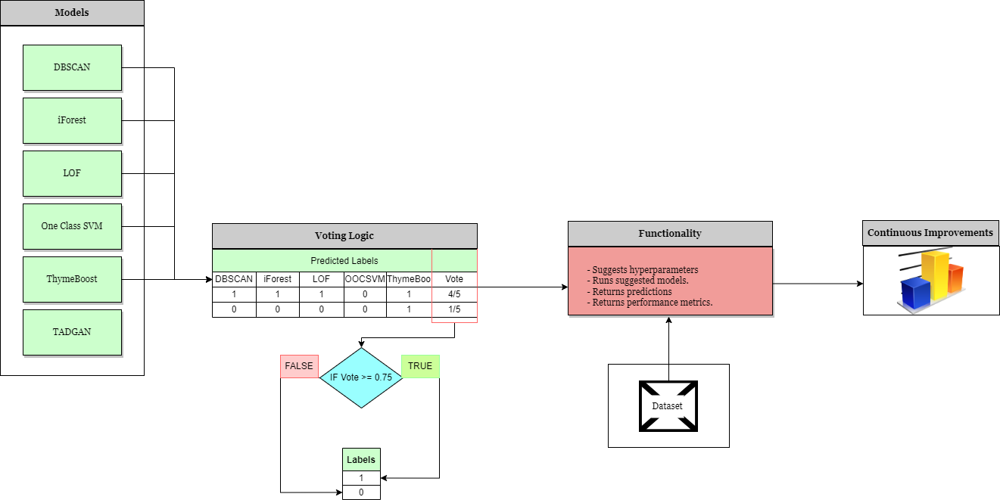

# AnomalyDetectionApp v0.1

 

## Table of contents ##
- [A statement of need](#A-statement-of-need)
  - [Overview of AnomalyDetectionApp](#Overview_of_AnomalyDetectionApp)
  - [Features](#Features)
  - [Target audience](#Target-audience)
- [Installation instructions](#Installation-instructions)
  - [Prerequisites](#Prerequisites)
  - [App installation](#App-installation)
- [Demo](#Demo)
  - [Data](#Data)
  - [Code](#Code)
- [Community guidelines](#Community-guidelines)
  - [Contribute to the software](#Contribute-to-the-software)
  - [Report issues or problems with the software](#Report-issues-or-problems-with-the-software)
  - [Seek support](#Seek-support)
- [Software license](#Software-license)

## A statement of need ##

### Overview of AnomalyDetectionApp ###
AnomalyDetectionApp is an anomaly detection python library that is based on the ensemble learning algorithm to derive better predictions. It combines the predictions of multiple independent anomaly detection models such as Isolation Forest, DBSCAN, ThymeBoost, One-Class Support Vector Machine, Local Outlier Factor and TADGAN. Then, it returns the output according as the average prediction of the individual models is above a certain threshold.

**Process Flow Diagram**



### Features ###
1. Handles time series data.
2. Deals with trends and seasonality.
3. Provides options to choose anomaly detection models for ensemble learning.
4. Suggests hyperparameters for each anomaly detection model.
4. Provides execution time for each anomaly detection model.
6. Provides more accurate anomaly predictions. 

**Choice of hyperparameters**
1. Isolation Forest
    - contamination = percentage of expected outliers.

2. DBSCAN 
    - min_samples: For n-dimensional data, min_samples = 2\*n, where n = the dimensionlity of the data.
    - eps: eps = the point of maximum curvature of the k-NN distance graph.
  
3. ThymeBoost
    - seasonal_period: seasonal_period = first expected seasonal period at the maximum amplitude, computed using Fast Fourier Transform.

4. One-Class Support Vector Machine
    - kernel: best optimal kernal using Optuna hyperparameter optimization framework.

5. Local Outlier Factor
    - alg: 

6. TADGAN
    - epochs: best optimal epoch using Orion hyperparameter optimization framework.

### Target audience ###
AnomalyDetectionApp should be of interest to readers who are involved in anomaly detection in time series data.

## Installation instructions ##

### Prerequisites ###
AnomalyDetectionApp has been developed and tested in Python Version: v3.7 and requires some libraries.

```python3 -m pip install -r "C:\Users\A408565\source\repos\Anomaly Detection Ensemble\requirements.txt"```

### Application installation ###
```python3 -m pip install AnomalyDetectionApp```

## Demo ##

### Data ###
To access the the exemplary dataset 

### Code ###

```from AnomalyDetectionApp import example```

## Community guidelines ##

### Contribute to the software ###
To contribute fixes, feature modifications or enhancements, a pull request can be created in the [Pull requests](https://github.com/devosmitachatterjee2018/AnomalyDetectionApp/pulls) tab of the project GitHub repository. When contributing to the software, the folowing should be included.
1. Description of the change;

2. Check that all tests pass;

3. Include new tests to report the change.

### Report issues or problems with the software ###
Any feature request or issue can be submitted to the the [Issues](https://github.com/devosmitachatterjee2018/AnomalyDetectionApp/issues) tab of the project GitHub repository. When reporting issues with the software, the folowing should be included.
1. Description of the problem;

2. Error message;

3. Python version and Operating System.

### Seek support ###
If any support needed, the authors can be contacted by e-mail @volvo.com. 

## Software license ##
AnomalyDetectionApp is released under the MIT License.

